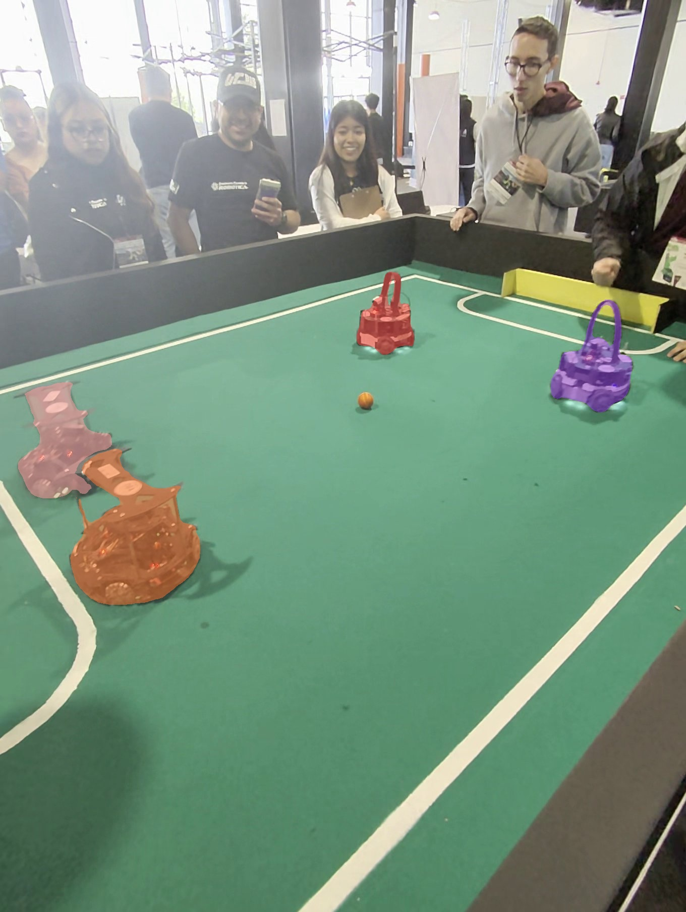
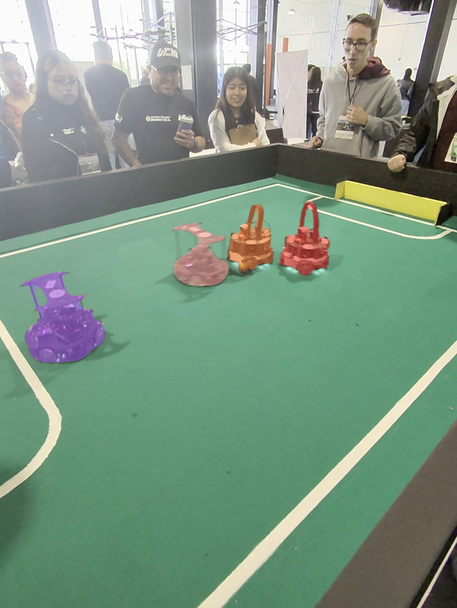

# Proyecto - Vision Por Computadora
Objetivo: Creación de un proyecto para la Copa FutBotMX con la rama de Visión por Computadora usando SAM 3 (Segment Anything Model 3) de Meta para analizar videos de partidos de fútbol robótico proporcionados por la Federación Mexicana de Robótica.

**Categoría:** Amateur

**Título:** Echomain

**Propuesta de Proyecto:** Sistema de análisis táctico basado en SAM 3 que segmenta, rastrea e interpreta el comportamiento dinámico de un partido de fútbol robótico mediante emociones tácticas y visualización histórica de trayectorias.

**Principales características:** 
- Interpreta emociones tácticas,
- Y visualiza ecos históricos del partido mediante Ghost Replay.

## Arquitectura Inicial
El pipeline de procesamiento se compone de las siguientes etapas:
1. **Segmentación Baseline:** Uso del modelo SAM 3 para extraer máscaras precisas de los robots, el balón y los límites del campo.
2. **Tracking (Rastreo):** Implementación de ByteTrack para asignar y mantener identificadores únicos a cada elemento a través del tiempo.
3. **Análisis y Visualización:** Procesamiento de trayectorias para dibujar mapas de calor, Ghost Replays y registrar eventos tácticos en pantalla.

## Avance M1 — Segmentación baseline

En este milestone probamos el modelo SAM 3 sobre frames representativos de partidos de fútbol robótico.

### Objetivos Completados
- Extracción de frames de prueba resguardando el peso del repositorio.
- Pruebas cruzadas de prompts (texto, punto, bounding box).
- Generación de máscaras baseline mediante un módulo reutilizable.
- Documentación técnica de la respuesta del modelo en entornos controlados.

### Evidencia Visual



### Hallazgos Clave
- **El Balón:** Fue segmentado exitosamente sin requerir preprocesamiento complejo, lo cual es una gran ventaja para la extracción de métricas.
- **Ambigüedad Semántica:** El modelo asocia "player" tanto a los robots como a la audiencia humana.
- **Limitaciones de Entorno:** El prompt "field" falló en detectar el campo de juego, requiriendo métodos tradicionales (polígonos) para delimitar la cancha.
- **Decisión para M2:** Abandonaremos la inferencia pura por texto (*Zero-Shot*). El Milestone 2 utilizará segmentación guiada por *Bounding Boxes* conectadas a algoritmos de Tracking.

> *Los detalles técnicos se encuentran en [Bitácora](docs/bitacora.md) y en [Registro de Errores y Hallazgos](docs/errores_y_hallazgos.md).*

## Requisitos e Instalación

**Hardware sugerido:** El procesamiento local ha sido probado en equipos con procesadores AMD Ryzen 5 5625U con Radeon Graphics. Para modelos como SAM 3, se recomienda un entorno con aceleración o paciencia en el procesamiento por CPU.

**Instrucciones:**
1. Clona este repositorio:
   ```bash
   git clone [https://github.com/Nnncyyy/Proyecto-VisionPorComputadora.git](https://github.com/Nnncyyy/Proyecto-VisionPorComputadora.git)
   cd Proyecto-VisionPorComputadora

2. Crea un entorno virtual e instala las dependencias:
    ```bash
    pip install -r requirements.txt

3. Descarga el modelo sam3.pt desde HuggingFace y colócalo en la carpeta assets/ (nota: este archivo está ignorado en Git por su tamaño).

> **Nota:** El modelo `sam3.pt` debe descargarse desde Hugging Face y colocarse en la carpeta `assets/`, ya que ha sido excluido de GitHub mediante el archivo `.gitignore` debido a su gran tamaño.


## Integrantes
- Nancy Ashanti Del Castillo Aguirre
- Diego Garcia Mendoza
