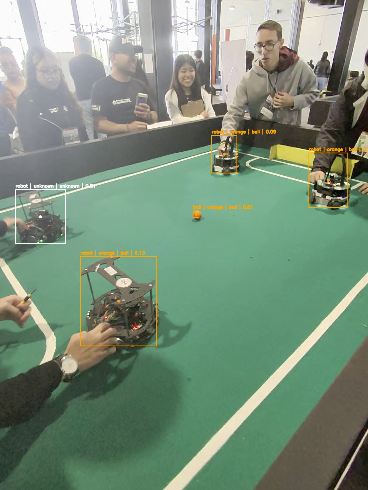
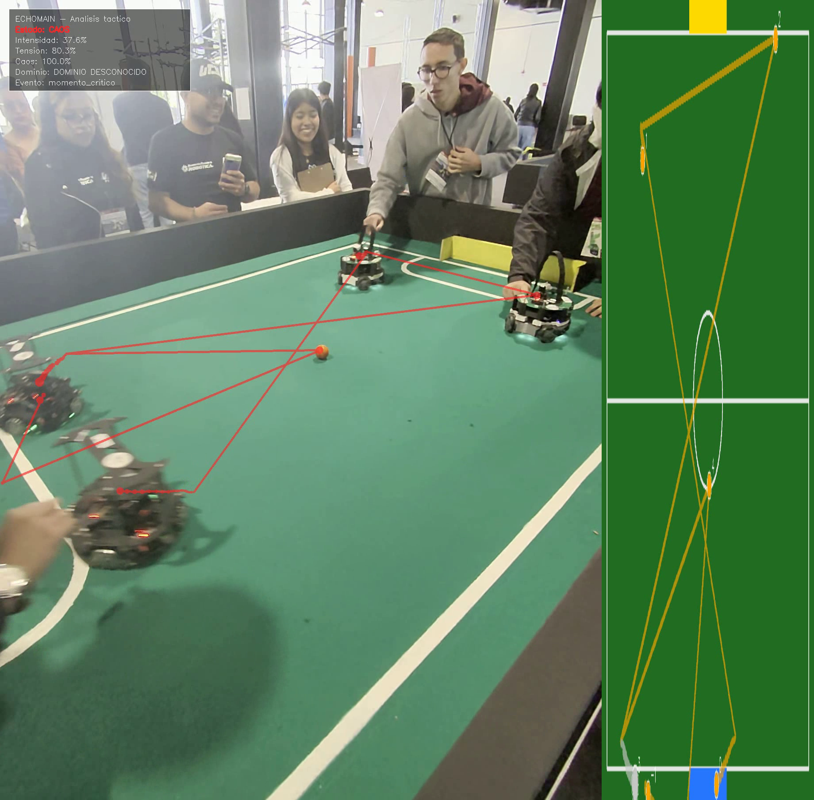
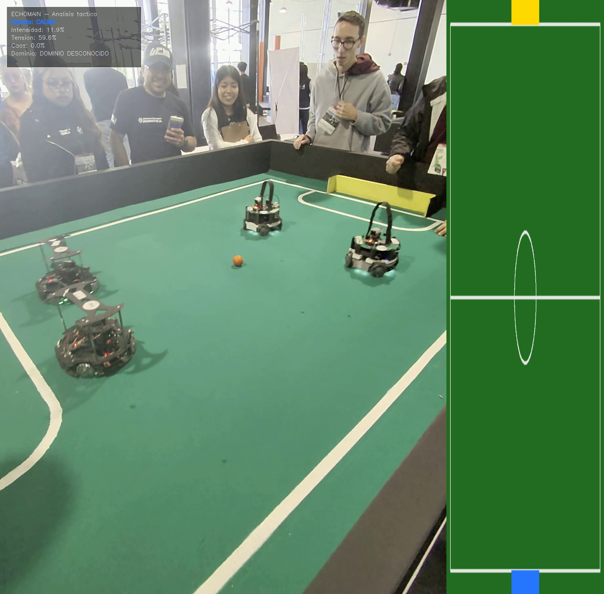

# Proyecto - Vision Por Computadora
Objetivo: Creación de un proyecto para la Copa FutBotMX con la rama de Visión por Computadora usando SAM 3 (Segment Anything Model 3) de Meta para analizar videos de partidos de fútbol robótico proporcionados por la Federación Mexicana de Robótica.

**Resumen**
**Categoría:** Amateur

**Título:** Echomain

**Propuesta de Proyecto:** Sistema de análisis táctico basado en SAM 3 que segmenta, rastrea e interpreta el comportamiento dinámico de un partido de fútbol robótico mediante emociones tácticas y visualización histórica de trayectorias.

**Principales características:** 
- Interpreta emociones tácticas,
- Y visualiza ecos históricos del partido mediante Ghost Replay.
- Segmenta elementos relevantes del partido.
- Rastrea robots y balón mediante tracking.
- Interpreta emociones tácticas.
- Visualiza ecos históricos del partido mediante Ghost Replay.
- Genera visualizaciones narrativas, mapa táctico 2D, dashboard y eventos aproximados.
---

**Descripción del proyecto**

Echomain es un sistema de visión por computadora orientado al análisis de partidos de fútbol robótico.

El proyecto parte de un video de FutBotMX y construye un pipeline que permite:
Leer un video.
Aplicar segmentación con SAM 3.
Detectar robots, balón y elementos del campo.
Rastrear objetos a través del tiempo.
Guardar trayectorias en archivos CSV.
Clasificar objetos mediante HSV.
Generar Ghost Replay.
Calcular emociones tácticas mediante reglas simples.
Detectar eventos aproximados.
Crear mapa de calor.
Crear mapa táctico 2D mediante homografía.
Mostrar un dashboard narrativo.
Generar una visualización final del partido.

La idea principal es transformar un video de fútbol robótico en una visualización táctica que permita entender el movimiento, la intensidad y los momentos importantes del partido.
---
## Integrantes
- Nancy Ashanti Del Castillo Aguirre
- Diego Garcia Mendoza
---

## Requisitos e Instalación

**Hardware sugerido:** El procesamiento local ha sido probado en equipos con procesadores AMD Ryzen 5 5625U con Radeon Graphics. Para modelos como SAM 3, se recomienda un entorno con aceleración o paciencia en el procesamiento por CPU.

**Dependencias principales**
El proyecto utiliza:

Python
OpenCV
NumPy
pandas
Matplotlib
tqdm
Supervision
Ultralytics
trackers / ByteTrack
SAM 3

**Instrucciones:**
1. Clona este repositorio:
   ```bash
   git clone [https://github.com/Nnncyyy/Proyecto-VisionPorComputadora.git](https://github.com/Nnncyyy/Proyecto-VisionPorComputadora.git)
   cd Proyecto-VisionPorComputadora

2. Crea un entorno virtual e instala las dependencias:

En Windows:

   python -m venv .venv
   .venv\Scripts\activate
   
En Linux/Mac:
   
   python -m venv .venv
   source .venv/bin/activate
   
   También se puede usar Conda:
   
   conda create -n futbot python=3.11
   conda activate futbot

E instala las dependencias
   ```bash
    pip install -r requirements.txt
   ```
3. Descarga el modelo sam3.pt desde HuggingFace y colócalo en la carpeta assets/ (nota: este archivo está ignorado en Git por su tamaño).

4. Descarga el video usado para el proyecto, que puede ser descargado desde el siguiente link `https://drive.google.com/file/d/1-39yAydXRA_O4dOj6KW_NeLdwjAcXPsN/view?usp=drive_link` y colócalo en la carpeta data/raw/ y renombralo con el nombre `videoInstrucciones.mov`, de esta manera debe quedar asi: `data/raw/videoInstrucciones.mov`

> **Nota:** El modelo `sam3.pt` debe descargarse desde Hugging Face y colocarse en la carpeta `assets/`, ya que ha sido excluido de GitHub mediante el archivo `.gitignore` debido a su gran tamaño.

**Verificar instalación**
python src/check_installation.py

Este script revisa la importación de librerías principales como:

OpenCV
NumPy
pandas
Matplotlib
tqdm
Supervision
Ultralytics


---

## Arquitectura Inicial
El pipeline de procesamiento se compone de las siguientes etapas:
1. **Segmentación Baseline:** Uso del modelo SAM 3 para extraer máscaras precisas de los robots, el balón y los límites del campo.
2. **Tracking (Rastreo):** Implementación de ByteTrack para asignar y mantener identificadores únicos a cada elemento a través del tiempo.
3. **Exportación de trayectorias:** Guardado de posiciones por frame en archivos CSV.
4. **HSV:** Clasificación de objetos por color para identificar balón naranja y aproximar robots por equipo.
5. **Ghost Replay:** Visualización de trayectorias históricas como ecos o estelas.
6. **Emociones tácticas:** Cálculo de estados como CALMA, ACTIVO, INTENSO, TENSION y CAOS.
7. **Eventos simples:** Detección aproximada de colisiones, tiros, cambios de dominio y momentos críticos.
8. **Homografía / mapa táctico 2D:** Proyección de posiciones hacia una vista superior de cancha.
9. **Dashboard narrativo:** Visualización de intensidad, tensión, caos, dominio y evento actual.
10. **Visualización final:** Combinación de video, tracking, Ghost Replay, dashboard y mapa táctico.
```bash
Video original 
↓ 
SAM 3 
↓ 
Segmentación 
↓ 
Objetos detectados 
↓
Tracking con ByteTrack 
↓
Historial de posiciones / CSV 
↓
HSV + métricas tácticas 
↓
Ghost Replay + emociones + eventos 
↓
Homografía / mapa táctico 2D 
↓
Dashboard narrativo 
↓
Video final
```
## Avance M1 — Segmentación baseline

En este milestone probamos el modelo SAM 3 sobre frames representativos de partidos de fútbol robótico.

### Objetivos Completados
- Extracción de frames de prueba resguardando el peso del repositorio.
- Pruebas cruzadas de prompts (texto, punto, bounding box).
- Generación de máscaras baseline mediante un módulo reutilizable.
- Documentación técnica de la respuesta del modelo en entornos controlados.

### Evidencia Visual


### Hallazgos Clave
- **El Balón:** Fue segmentado exitosamente sin requerir preprocesamiento complejo, lo cual es una gran ventaja para la extracción de métricas.
- **Ambigüedad Semántica:** El modelo asocia "player" tanto a los robots como a la audiencia humana.
- **Limitaciones de Entorno:** El prompt "field" falló en detectar el campo de juego, requiriendo métodos tradicionales (polígonos) para delimitar la cancha.
- **Decisión para M2:** Abandonaremos la inferencia pura por texto (*Zero-Shot*). El Milestone 2 utilizará segmentación guiada por *Bounding Boxes* conectadas a algoritmos de Tracking.

---

## M2 — Tracking funcional
### Objetivo
Rastrear robots y balón a través del video usando las segmentaciones obtenidas con SAM 3 y un tracker basado en ByteTrack.

### Avance M2
En este milestone integramos el procesamiento de video frame por frame con un tracker basado en ByteTrack. El objetivo fue asignar IDs persistentes a robots y balón, guardar trayectorias en CSV y generar una primera visualización con máscaras, cajas, IDs y trails.

### Resultados
- Procesamiento frame por frame.
- Segmentación con SAM 3 usando prompts definidos en M1.
- Tracking de objetos con IDs.
- Exportación de trayectorias a CSV.
- Primer video local anotado.

### Evidencia visual


(Es dinámico y se genera cuando se ejecuta el archivo main_m2)

> *Los detalles técnicos se encuentran en [Bitácora](docs/bitacora.md) y en [Registro de Errores y Hallazgos](docs/errores_y_hallazgos.md).*

---

## M3 — HSV, Homografía, Ghost Replay y emociones tácticas

### Objetivo
Convertir las trayectorias generadas en M2 en una visualización narrativa del partido. En este milestone se agregan clasificación por color mediante HSV, métricas de movimiento, emociones tácticas, eventos simples, Ghost Replay, mapa de calor, homografía opcional y dashboard.

### Componentes de M3
- **HSV:** clasifica objetos como robot azul, robot rojo, balón naranja o desconocido.
- **Ghost Replay:** dibuja posiciones pasadas como estelas o ecos del movimiento.
- **Emociones tácticas:** calcula estados como `CALMA`, `ACTIVO`, `INTENSO`, `TENSION` y `CAOS` con reglas explicables.
- **Homografía / mapa táctico 2D:** proyecta posiciones a una vista superior de la cancha si se definen puntos manuales.
- **Eventos simples:** detecta posibles colisiones, tiros o cambios de dominio.
- **Dashboard:** muestra intensidad, tensión, caos, dominio y evento actual sobre el video.

### Ejecutar M3 sin homografía

Primero ejecuta M2 para generar:

```text
outputs/metrics/tracks.csv
```

Después corre:

```bash
python src/main_m3.py \
  --tracks outputs/metrics/tracks.csv \
  --video data/raw/videoInstrucciones.mov \
  --max-frames 180
```

### Ejecutar M3 con homografía

Copia la plantilla:

```text
config/homography_points_template.json
```

y guárdala como:

```text
config/homography_points.json
```

Edita `image_points` con las cuatro esquinas reales de la cancha en el video. Luego ejecuta:

```bash
python src/main_m3.py \
  --tracks outputs/metrics/tracks.csv \
  --video data/raw/videoInstrucciones.mov \
  --homography-points config/homography_points.json \
  --max-frames 180
```

### Salidas locales esperadas

```text
outputs/metrics/tracks_with_color.csv
outputs/metrics/tracks_projected.csv
outputs/metrics/emotions.csv
outputs/metrics/events.csv
outputs/figures/m3_heatmap_activity.jpg
outputs/figures/m3_tactical_map_sample.jpg
outputs/videos/m3_narrative_demo.mp4
```

Estos archivos se generan localmente y no se suben completos al repositorio por tamaño. Solo se subirán evidencias ligeras en `docs/assets/m3/`.

### Limitaciones actuales
- HSV puede fallar con sombras, reflejos o iluminación variable.
- Las emociones tácticas son reglas simples, no emociones humanas reales.
- Los eventos son aproximados.
- La homografía depende de puntos manuales bien elegidos.

---

## Avance M3 — HSV, Ghost Replay, emociones tácticas y mapa táctico 2D

En el Milestone 3 convertimos el tracking obtenido en M2 en una visualización narrativa del partido. El objetivo fue que el sistema no solo mostrara robots y balón en movimiento, sino que también interpretara el estado táctico del juego mediante reglas simples y visualizaciones expresivas.

El M3 integra:

```text
Clasificación HSV
Ghost Replay
Memoria emocional
Colores emocionales
Eventos simples
Homografía
Mapa táctico 2D
Mapa de calor
Dashboard narrativo
Visualización combinada
```

---

### Arquitectura del M3

```text
tracks.csv + video original
        ↓
Clasificación HSV
        ↓
Métricas de movimiento
        ↓
Motor de emociones tácticas
        ↓
Ghost Replay
        ↓
Eventos simples
        ↓
Homografía / mapa táctico 2D
        ↓
Dashboard narrativo
        ↓
Video final M3
```

---

### Componentes implementados

| Componente               | Descripción                                            | Evidencia                                                     |
| ------------------------ | ------------------------------------------------------ | ------------------------------------------------------------- |
| HSV                      | Clasificación de color para balón y objetos detectados | `docs/assets/m3/hsv/hsv_sample.jpg`                           |
| CSV enriquecido          | Tracks con color, equipo y score                       | `docs/assets/m3/csv/sample_tracks_m3_metrics.csv`             |
| Ghost Replay básico      | Estelas de posiciones pasadas                          | `docs/assets/m3/ghost_replay/ghost_basic_sample.jpg`          |
| Ghost Replay inteligente | Estelas influenciadas por movimiento/estado táctico    | `docs/assets/m3/ghost_replay/ghost_smart_sample.jpg`          |
| Emociones tácticas       | Estados como CALMA, TENSION y CAOS                     | `docs/assets/m3/events/sample_emotions.csv`                   |
| Colores emocionales      | Trails y dashboard cambian según el estado             | `docs/assets/m3/emotional_colors/emotional_colors_sample.jpg` |
| Memoria emocional        | Longitud del Ghost Replay según el estado              | `docs/assets/m3/emotional_memory/memory_sample.jpg`           |
| Eventos simples          | Detección aproximada de momentos tácticos              | `docs/assets/m3/events/sample_events.csv`                     |
| Homografía               | Proyección del video al mapa 2D                        | `docs/assets/m3/homography/homography_points.jpg`             |
| Mapa táctico 2D          | Visualización superior del partido                     | `docs/assets/m3/tactical_map/tactical_map_sample.jpg`         |
| Mapa de calor            | Zonas de mayor actividad                               | `docs/assets/m3/heatmap/heatmap_sample.jpg`                   |
| Dashboard narrativo      | Estado, intensidad, tensión, caos y evento             | `docs/assets/m3/dashboard/dashboard_sample.jpg`               |
| Visualización narrativa  | Resultado combinado del M3                             | `docs/assets/m3/narrative/m3_narrative_sample.jpg`            |

---

### Evidencias principales

#### Clasificación HSV



HSV se utilizó para estimar el color dominante de las detecciones. Funcionó especialmente bien para identificar el balón naranja, aunque presentó confusiones en algunos robots debido a reflejos, LEDs o componentes internos.

#### Ghost Replay


El Ghost Replay permite visualizar posiciones pasadas de robots y balón, generando una memoria visual del movimiento.

#### Colores emocionales y memoria emocional



Los trails cambian de color según el estado táctico del partido. En estados como `CAOS` o `TENSION`, las estelas se vuelven más marcadas para comunicar visualmente la intensidad del momento.

#### Homografía y mapa táctico 2D



La homografía permite proyectar las posiciones del video original hacia una cancha 2D. Esta visualización funciona como apoyo táctico y no como medición exacta.

#### Dashboard narrativo


El dashboard muestra el estado táctico del partido, intensidad, tensión, caos, dominio y eventos aproximados.

#### Visualización narrativa final


La salida final combina video original, Ghost Replay, colores emocionales, dashboard y mapa táctico 2D.

---

### Archivos generados

Durante el M3 se generan archivos locales como:

```text
outputs/metrics/tracks_with_color.csv
outputs/metrics/tracks_projected.csv
outputs/metrics/emotions.csv
outputs/metrics/events.csv
outputs/figures/m3_heatmap_activity.jpg
outputs/videos/m3_narrative_demo.mp4
```

Por tamaño, algunos archivos completos no se suben directamente al repositorio. En su lugar, se incluyen muestras ligeras en:

```text
docs/assets/m3/
```

---

### Cómo ejecutar M3

Primero debe existir el archivo generado en M2:

```text
outputs/metrics/tracks.csv
```

Luego se puede ejecutar M3 sin homografía:

```bash
python src/main_m3.py --tracks outputs/metrics/tracks.csv --video data/raw/videoInstrucciones.mov --max-frames 180
```

Para ejecutar M3 con homografía:

```bash
python src/main_m3.py --tracks outputs/metrics/tracks.csv --video data/raw/videoInstrucciones.mov --homography-points config/homography_points.json --max-frames 180
```

---

### Limitaciones del M3

* HSV funciona bien para el balón naranja, pero puede confundir robots debido a reflejos, luces o componentes internos.
* El dominio puede aparecer como `DOMINIO DESCONOCIDO` porque la clasificación por equipo todavía no es completamente robusta.
* La homografía es una aproximación visual y depende de la correcta selección de los cuatro puntos de la cancha.
* Los eventos detectados son aproximados y se basan en reglas simples.
* Las emociones tácticas no representan emociones humanas reales; son estados visuales calculados con métricas del partido.
* El resultado depende directamente de la calidad del tracking generado en M2.

---

### Estado del Milestone

El M3 queda completado como una primera versión funcional de visualización narrativa. La implementación demuestra que es posible convertir tracking de robots y balón en una experiencia visual con memoria, emociones tácticas, eventos y mapa táctico 2D.

---

## Milestone 4 — Entrega final y reproducibilidad

En el Milestone 4 se preparó el proyecto para su entrega final. Esta etapa no agrega nuevos módulos de análisis, sino que consolida el trabajo realizado en M1, M2 y M3 mediante reproducibilidad, documentación, validación del entorno y preparación de entregables.

### M4-01 — Script principal reproducible

Se agregó el script:

```bash
python src/run_final_demo.py
```

Este script permite ejecutar el demo final del proyecto de forma más sencilla. Antes de ejecutar la visualización narrativa, valida que existan los archivos necesarios:

```text
data/raw/videoInstrucciones.mov
outputs/metrics/tracks.csv
config/homography_points.json
```

Si el archivo de homografía existe, el demo se ejecuta con mapa táctico 2D. Si no existe, el script puede ejecutarse sin homografía.

El resultado esperado es:

```text
outputs/videos/m3_narrative_demo.mp4
```

### M4-02 — Instalación y reproducción desde cero

Para verificar que el entorno tenga las dependencias necesarias, se agregó el script:

```bash
python src/check_installation.py
```

Este script revisa la importación de librerías principales como:

```text
OpenCV
NumPy
pandas
Matplotlib
tqdm
Supervision
Ultralytics
```

La instalación del proyecto se realiza con:

```bash
pip install -r requirements.txt
```

También se documentó el proceso completo en:

```text
docs/m4_reproducibilidad.md
```
### M4-03 — Completar README final
Este README se completo
### M4-04 - Crear video demo máximo 2 minutos
```bash
Enlace al video demo
   PEGAR_AQUI_LINK_VIDEO_DEMO
```
```bash
Debe mostrar:
Video original.
Segmentación con SAM 3.
Tracking con IDs.
Exportación de trayectorias.
Ghost Replay.
Emociones tácticas.
Eventos aproximados.
Dashboard narrativo.
Mapa táctico 2D o mapa de calor.
Resultado final del proyecto.
```
### M4-05 -- Crear Reel de Instagram
```bash
Debe mostrar:

Nombre del proyecto: Echomain.
Problema abordado.
Segmentación/tracking.
Ghost Replay.
Dashboard o visualización más atractiva.
Resultado final.
Créditos breves del equipo.
```
```
Enlace al Reel de Instagram
   PEGAR_AQUI_LINK_REEL_INSTAGRAM
```
### M4-06 -- Revisar créditos y licencias
**Créditos**

Este proyecto utiliza herramientas, modelos y librerías de código abierto o de uso académico:
- SAM 3 — Segmentación de objetos en imágenes y video.
- Ultralytics — Carga e inferencia de modelos YOLO/SAM.
- Roboflow Supervision — Manejo de detecciones, anotadores, visualización y utilidades de video.
- ByteTrack / trackers — Seguimiento de objetos e IDs persistentes.
- OpenCV — Lectura de video, HSV, homografía y dibujo de visualizaciones.
- NumPy — Operaciones numéricas, coordenadas y matrices.
- pandas — Manejo de CSV, trayectorias y métricas.
- Matplotlib — Visualización de mapas de calor y figuras.
- tqdm — Barras de progreso.
- Federación Mexicana de Robótica / Copa FutBotMX — Videos y contexto del reto.

Los créditos detallados se encuentran en:
   docs/creditos_licencias.md

**Licencia**
Este proyecto incluye un archivo de licencia en:
LICENSE
Cada dependencia conserva su propia licencia. El uso de SAM 3, Ultralytics, Supervision, OpenCV y demás herramientas está sujeto a sus respectivos términos y condiciones.

### M4-07 - Validar evidencias, enlaces y estructura final del repositorio
**Limitaciones**
- SAM 3 puede tardar mucho al ejecutarse en CPU.
- El procesamiento depende de la resolución y duración del video.
- La segmentación depende de la iluminación, perspectiva, movimiento y oclusiones.
- El balón puede perderse en algunos frames por ser pequeño o moverse rápidamente.
- El tracking puede sufrir cambios de ID cuando los robots se cruzan o se ocultan.
- HSV puede fallar con sombras, reflejos, LEDs o colores similares.
- La clasificación por equipo todavía puede producir resultados desconocidos o ambiguos.
- La homografía es una aproximación visual, no una medición exacta.
- Los eventos son aproximados y se basan en reglas simples.
- Las emociones tácticas no representan emociones humanas reales; son estados visuales calculados a partir de métricas del partido.
- Los videos, modelos y outputs pesados no se suben al repositorio por tamaño.

**Estructura del repositorio**
```text
Proyecto-VisionPorComputadora/
├── assets/
│   └── sam3.pt                    # No se sube a GitHub
├── config/
│   ├── homography_points_template.json
│   └── homography_points.json      # Configuración local opcional
├── data/
│   └── raw/
│       └── videoInstrucciones.mov  # No se sube a GitHub
├── docs/
│   ├── assets/
│   │   ├── m1/
│   │   ├── m2/
│   │   └── m3/
│   ├── bitacora.md
│   ├── errores_y_hallazgos.md
│   ├── creditos_licencias.md
│   └── m4_reproducibilidad.md
├── notebooks/
├── outputs/
│   ├── metrics/
│   ├── figures/
│   └── videos/
├── src/
│   ├── check_installation.py
│   ├── run_final_demo.py
│   ├── main_m2.py
│   ├── main_m3.py
│   ├── segmentation.py
│   ├── tracking.py
│   ├── visualization.py
│   ├── color_utils.py
│   ├── motion_metrics.py
│   ├── ghost_replay.py
│   ├── emotion_engine.py
│   ├── events.py
│   ├── homography.py
│   ├── tactical_map.py
│   ├── heatmap.py
│   └── dashboard.py
├── requirements.txt
├── README.md
├── LICENSE
└── .gitignore
```
**Archivos que no se suben al repositorio**
Por tamaño, no se suben:
- assets/sam3.pt
- data/raw/videoInstrucciones.mov
- outputs/videos/
- outputs/metrics/
- outputs/figures/

En su lugar, se incluyen evidencias ligeras en:
docs/assets/

### M4-08 -- Congelar entrega final
**Estado final del proyecto**
Echomain demuestra que es posible convertir un video de fútbol robótico en una visualización narrativa basada en segmentación, tracking, memoria visual y métricas tácticas simples.

El sistema no busca reemplazar un análisis deportivo profesional, sino mostrar una aproximación creativa, explicable y reproducible para interpretar visualmente un partido robótico mediante visión por computadora.

**Enlaces finales**

| Entregable | Enlace |
|---|---|
| Repositorio GitHub | [Proyecto-VisionPorComputadora](https://github.com/Nnncyyy/Proyecto-VisionPorComputadora) |
| Video usado | [Video de entrada](https://drive.google.com/file/d/1-39yAydXRA_O4dOj6KW_NeLdwjAcXPsN/view?usp=drive_link) |
| Video demo | PEGAR_AQUI_LINK_VIDEO_DEMO |
| Reel de Instagram | PEGAR_AQUI_LINK_REEL_INSTAGRAM |
| Bitácora | [docs/bitacora.md](docs/bitacora.md) |
| Errores y hallazgos | [docs/errores_y_hallazgos.md](docs/errores_y_hallazgos.md) |
| Créditos y licencias | [docs/creditos_licencias.md](docs/creditos_licencias.md) |
| Reproducibilidad | [docs/m4_reproducibilidad.md](docs/m4_reproducibilidad.md) |

