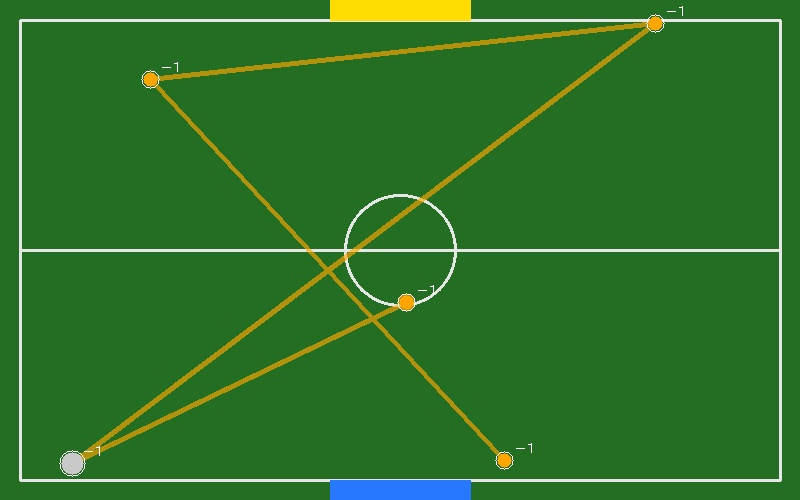
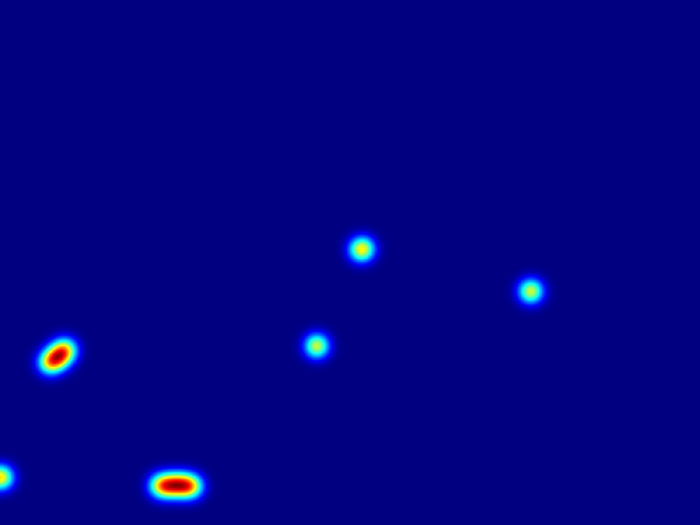

# M3 — HSV, Ghost Replay, emociones tácticas y visualización narrativa

## Objetivo general del M3

El objetivo del Milestone 3 fue transformar las trayectorias obtenidas en M2 en una visualización narrativa del partido. Para lograrlo, se integraron módulos de clasificación por color usando HSV, Ghost Replay, emociones tácticas basadas en reglas, eventos simples, homografía, mapa táctico 2D, mapa de calor y dashboard narrativo.

La idea principal fue pasar de un sistema que solo rastrea objetos a un sistema que interpreta visualmente el estado del partido.

Arquitectura general:

```text
Video + tracks.csv
        ↓
Clasificación HSV
        ↓
Métricas de movimiento
        ↓
Ghost Replay
        ↓
Emociones tácticas
        ↓
Eventos simples
        ↓
Homografía / mapa táctico 2D
        ↓
Dashboard narrativo
        ↓
Visualización final M3
```

---

## M3-01 — Implementar detector HSV para robots y balón

### Objetivo

Implementar una clasificación básica por color usando el espacio HSV para estimar el color dominante de los objetos detectados. El propósito fue identificar visualmente objetos como balón naranja, posibles robots por color y objetos desconocidos.

### Implementación

Se creó un módulo basado en OpenCV que convierte regiones de imagen de BGR a HSV y evalúa rangos de color definidos para naranja, azul y rojo. La clasificación se aplicó sobre las regiones detectadas previamente por el pipeline de tracking.

### Archivos relacionados

```text
src/color_utils.py
src/export_hsv_sample.py
docs/assets/m3/hsv/hsv_sample.jpg
```

### Evidencia

#### HSV


### Resultado

La evidencia muestra etiquetas como:

```text
ball | orange | ball | 0.81
robot | orange | ball | 0.09
robot | unknown | unknown | 0.01
```

Esto demuestra que el sistema calcula `class_name`, `color`, `team` y `color_score`.

### Limitaciones

HSV funcionó bien para identificar el balón naranja, pero algunos robots fueron clasificados como naranja debido a reflejos, LEDs, cables o elementos internos de color similar. Esta limitación se documenta como parte del aprendizaje del M3.

### Estado

Completado con limitaciones documentadas.

---

## M3-02 — Integrar clasificación HSV al CSV de trayectorias

### Objetivo

Agregar información de color y equipo al CSV generado en M2 para permitir análisis posteriores de dominio, eventos y visualización táctica.

### Implementación

A partir del archivo `tracks.csv`, el sistema genera una versión enriquecida con columnas adicionales:

```text
team
color
color_score
```

Estas columnas permiten saber si un objeto fue clasificado como `orange`, `blue`, `red` o `unknown`.

### Archivos relacionados

```text
outputs/metrics/tracks_with_color.csv
docs/assets/m3/csv/sample_tracks_m3_metrics.csv
```

### Evidencia

```markdown
[CSV de muestra](assets/m3/csv/sample_tracks_m3_metrics.csv)
```

### Resultado

Se obtuvo un CSV enriquecido que permite conectar tracking, clasificación HSV y análisis emocional.

### Estado

Completado.

---

## M3-03 — Implementar Ghost Replay básico

### Objetivo

Implementar una visualización de memoria visual donde los objetos dejan una estela o trayectoria en pantalla.

### Implementación

El Ghost Replay básico utiliza el historial de posiciones de cada objeto para dibujar puntos o líneas que representan posiciones pasadas.

### Archivos relacionados

```text
src/ghost_replay.py
docs/assets/m3/ghost_replay/ghost_basic_sample.jpg
```

### Evidencia

#### Ghost Replay


### Resultado

Se logró visualizar la trayectoria de robots y balón sobre el video, permitiendo entender mejor el desplazamiento de los objetos durante el partido.

### Estado

Completado.

---

## M3-04 — Implementar Ghost Replay inteligente

### Objetivo

Hacer que el Ghost Replay no sea solo una estela fija, sino una representación visual que cambie según el movimiento y el estado táctico.

### Implementación

El sistema modifica la longitud y apariencia de las trayectorias dependiendo de métricas como velocidad, intensidad y estado emocional. En estados como `CAOS` o `TENSION`, las estelas se vuelven más visibles o prolongadas.

### Archivos relacionados

```text
src/ghost_replay.py
src/motion_metrics.py
docs/assets/m3/ghost_replay/ghost_smart_sample.png
```

### Evidencia

#### Ghost Replay Inteligente


### Resultado

Se obtuvo una visualización más expresiva del movimiento, especialmente en momentos de alta actividad.

### Estado

Completado.

---

## M3-05 — Crear motor simple de emociones tácticas

### Objetivo

Crear un sistema basado en reglas para interpretar el estado táctico del partido. No se busca detectar emociones humanas, sino representar estados del juego mediante métricas.

### Implementación

El motor emocional calcula valores como:

```text
Intensidad
Tensión
Caos
Dominio
Estado táctico
```

Los estados generados incluyen:

```text
CALMA
ACTIVO
INTENSO
TENSION
CAOS
```

### Archivos relacionados

```text
src/emotion_engine.py
docs/m3_emotion_rules.md
docs/assets/m3/events/sample_emotions.csv
```

### Evidencia

```markdown
[CSV de emociones](assets/m3/events/sample_emotions.csv)
```

### Resultado

El dashboard muestra valores como intensidad, tensión, caos y estado del partido. Esto permite que el video no solo muestre movimiento, sino una interpretación táctica del momento.

### Estado

Completado.

---

## M3-06 — Aplicar colores emocionales a trails y dashboard

### Objetivo

Aplicar colores visuales a las trayectorias y dashboard dependiendo del estado táctico del partido.

### Implementación

Se asignaron colores a los estados emocionales:

```text
CALMA → azul
ACTIVO → amarillo
TENSION → naranja
CAOS → rojo
MOMENTO CRÍTICO → morado / rojo intenso
```

### Archivos relacionados

```text
src/visualization.py
src/dashboard.py
docs/assets/m3/emotional_colors/emotional_colors_sample.png
```

### Evidencia

#### Colores Emocionales


### Resultado

En momentos de caos o tensión, las trayectorias cambian visualmente y refuerzan la narrativa del partido.

### Estado

Completado.

---

## M3-07 — Implementar memoria emocional del Ghost Replay

### Objetivo

Modificar la longitud de la memoria visual dependiendo del estado táctico.

### Implementación

La memoria del Ghost Replay cambia según el estado:

```text
CALMA → memoria corta
ACTIVO → memoria media
TENSION → memoria media/larga
CAOS → memoria larga
```

### Archivos relacionados

```text
src/ghost_replay.py
src/emotion_engine.py
docs/assets/m3/emotional_memory/emotional_memory_sample.png
```

### Evidencia

#### Memoria Emocional


### Resultado

En estados de alta actividad, el sistema conserva más posiciones pasadas para hacer visible la intensidad del momento.

### Estado

Completado.

---

## M3-08 — Detectar eventos simples del partido

### Objetivo

Detectar eventos aproximados del partido a partir de posiciones, velocidades y estados tácticos.

### Eventos implementados

```text
posible_tiro
posible_colision
momento_critico
cambio_de_dominio
```

### Archivos relacionados

```text
src/events.py
docs/assets/m3/events/sample_events.csv
```

### Evidencia

```markdown
[CSV de eventos](assets/m3/events/sample_events.csv)
```

### Resultado

El sistema genera eventos simples que pueden mostrarse en el dashboard narrativo.

### Limitaciones

Los eventos son aproximaciones basadas en reglas y no deben interpretarse como detecciones perfectas.

### Estado

Completado.

---

## M3-09 — Implementar homografía y mapa táctico 2D

### Objetivo

Proyectar posiciones del video original a un mapa táctico 2D de la cancha.

### Implementación

Se seleccionaron cuatro puntos de referencia de la cancha en el video y se mapearon a un plano 2D canónico. Con esta transformación, las posiciones de robots y balón pueden visualizarse sobre una cancha vista desde arriba.

### Archivos relacionados

```text
src/homography.py
src/tactical_map.py
config/homography_points.json
docs/assets/m3/homography/homography_points.png
docs/assets/m3/tactical_map/m3_tactical_map_sample.jpg
```

### Evidencia

#### Puntos de Homografía


#### Mapa táctico 2D



### Resultado

El mapa táctico 2D se muestra a la derecha del video y permite visualizar trayectorias proyectadas.

### Limitaciones

La homografía es una aproximación visual. Si los puntos se seleccionan con poca precisión o si la cámara se mueve, la proyección puede deformarse.

### Estado

Completado.

---

## M3-10 — Crear mapa de calor o zonas de actividad

### Objetivo

Generar una visualización acumulada de actividad del partido.

### Implementación

Se utilizaron las posiciones de los objetos para generar un mapa de calor que representa zonas con mayor movimiento o concentración.

### Archivos relacionados

```text
src/heatmap.py
docs/assets/m3/heatmap/heatmap_sample.jpg
```

### Evidencia

#### Mapa de calor


### Resultado

Se obtuvo un mapa de calor útil para identificar zonas activas del partido.

### Estado

Completado.

---

## M3-11 — Crear dashboard narrativo

### Objetivo

Mostrar información táctica en pantalla junto al video.

### Implementación

Se creó un dashboard que muestra:

```text
Estado
Intensidad
Tensión
Caos
Dominio
Evento
```

### Archivos relacionados

```text
src/dashboard.py
docs/assets/m3/dashboard/dashboard_sample.jpg
```

### Evidencia

#### Dashboard narrativo


### Resultado

El dashboard permite interpretar el estado del partido en tiempo real dentro del video generado.

### Estado

Completado.

---

## M3-12 — Crear visualización narrativa combinada

### Objetivo

Integrar en una sola salida visual todos los componentes del M3.

### Componentes integrados

```text
Video original
Ghost Replay
Colores emocionales
Dashboard táctico
Eventos simples
Mapa táctico 2D
Homografía
```

### Archivos relacionados

```text
src/main_m3.py
outputs/videos/m3_narrative_demo.mp4
docs/assets/m3/narrative/m3_narrative_sample.png
```

### Evidencia

#### Visualización Narrativa M3


### Resultado

Se generó un video narrativo donde el partido se visualiza de forma más interpretativa y expresiva.

### Estado

Completado.

---

## M3-13 — Actualizar README con resultados M3

### Objetivo

Actualizar la documentación principal del repositorio con los resultados, evidencias y limitaciones del M3.

### Contenido agregado

```text
Descripción del M3
Arquitectura
Evidencias visuales
Componentes implementados
Limitaciones
Cómo ejecutar M3
```

### Estado

Completado