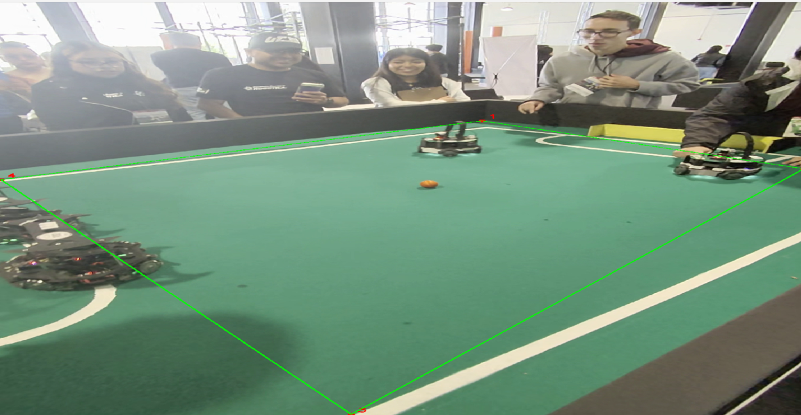

# M3 — Homografía y mapa táctico 2D

## Objetivo

Proyectar posiciones del video a un mapa 2D de la cancha para visualizar trayectorias y actividad táctica.

## Proceso utilizado

El proceso general fue:

```text
Seleccionar 4 puntos de la cancha en el video
        ↓
Definir 4 puntos equivalentes en el mapa 2D
        ↓
Calcular matriz de homografía
        ↓
Proyectar posiciones x_center, y_center
        ↓
Dibujar puntos y trayectorias en mapa táctico
```

## Archivo de puntos

Crear un archivo JSON con este formato:

```json
{
  "image_points": [[100, 100], [700, 100], [750, 500], [80, 500]],
  "map_points": [[0, 0], [800, 0], [800, 500], [0, 500]]
}
```

## Puntos de referencia

Se seleccionaron cuatro puntos de la cancha en el siguiente orden:

```text
1. Esquina superior izquierda
2. Esquina superior derecha
3. Esquina inferior derecha
4. Esquina inferior izquierda
```

Estos puntos se guardaron en:

```text
config/homography_points.json
```

---

## Uso

```bash
python src/main_m3.py \
  --tracks outputs/metrics/tracks.csv \
  --video data/raw/videoInstrucciones.mov \
  --homography-points config/homography_points.json
```

## Salidas esperadas

```text
outputs/metrics/tracks_projected.csv
outputs/figures/m3_tactical_map_sample.jpg
```
---


## Evidencia

### Puntos de Homografía


### Mapa táctico 2D


---

## Resultados

Se logró generar un mapa táctico 2D a la derecha del video narrativo. El fondo de la cancha permanece estático, mientras que los puntos y trayectorias proyectadas representan el movimiento de robots y balón.

---

## Limitaciones

La homografía es una aproximación visual. Puede deformarse si:

```text
los puntos se seleccionan mal
las esquinas reales no son completamente visibles
la cámara se mueve
el tracking genera coordenadas incorrectas
los objetos detectados están fuera del área de la cancha
```

Aun con estas limitaciones, el mapa táctico cumple su propósito como apoyo visual para entender el partido.

---

## Decisión para el proyecto

Se decidió conservar la homografía como una herramienta de visualización narrativa y no como medición exacta del campo.