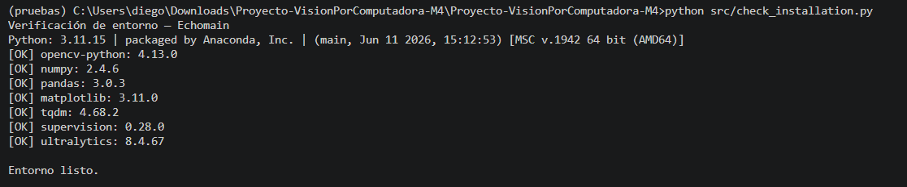
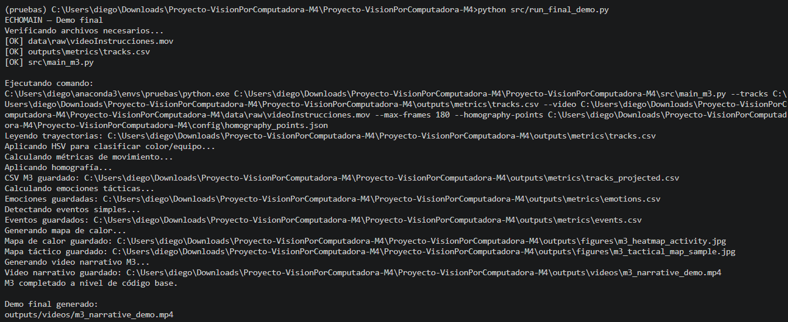

# M4 — Reproducibilidad

## Objetivo

Verificar que el proyecto pueda ejecutarse desde una instalación limpia.

## Pasos de instalación

```bash
git clone https://github.com/Nnncyyy/Proyecto-VisionPorComputadora.git
cd Proyecto-VisionPorComputadora
python -m venv .venv
source .venv/Scripts/activate
pip install -r requirements.txt
```

### En PowerShell

```powershell
.venv\Scripts\Activate.ps1
```

## Verificar entorno

```bash
python src/check_installation.py
```

## Archivos necesarios

El repositorio no incluye archivos pesados como videos completos o modelos.

El usuario debe colocar manualmente:

```text
data/raw/videoInstrucciones.mov
assets/sam3.pt
```

## Ejecutar demo final

```bash
python src/run_final_demo.py
```

## Resultado esperado

```text
outputs/videos/m3_narrative_demo.mp4
```

## Evidencia de reproducción

Se realizó una prueba de instalación y ejecución desde cero. Como evidencia se guardaron capturas y logs de terminal.

### Verificación del entorno



### Verificación de reproducibilidad




## Limitaciones

El demo final depende del archivo `tracks.csv` generado en M2. Si no existe, primero debe ejecutarse el pipeline de tracking.